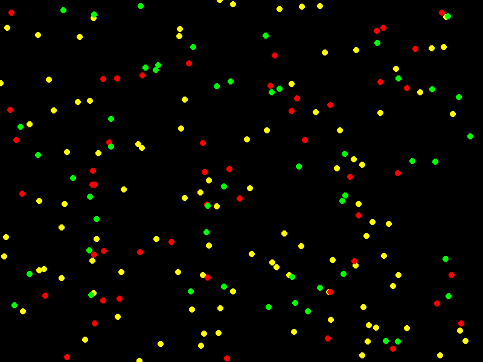

# Trying out Game Of Life Codes

## Installation of tools

Install tools through

``` (bash)
python tools/setup.py install
```

## Running the code

Run the code using

``` (bash)
python -m <Game>.main
```

### Use the following controls

- Mouse click to make a point alive
- `space` to start simulation
- `r` to start and stop recording

## Game Of Life Code

Game of life codes are set of simulations which leads to a life-like behaviour based on simple rules.

### Conway's Game Of Life


### Code Of Life


